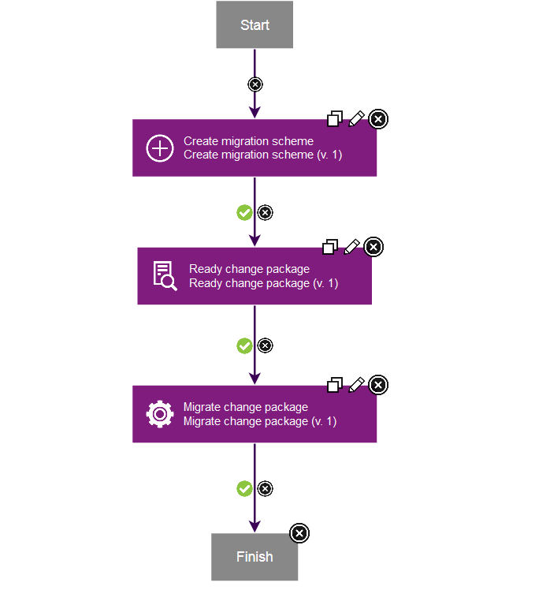
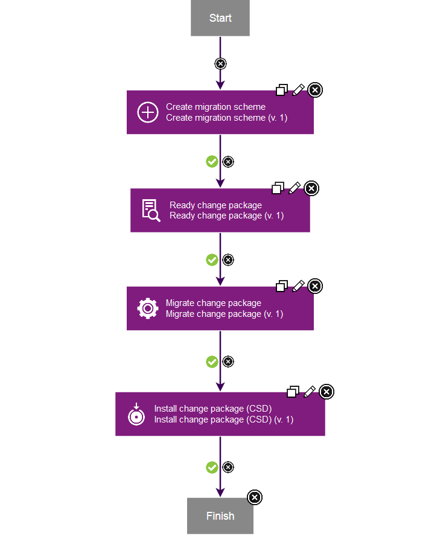

CICS CM (Beta) - Component Templates
====================================

# Component Templates

### Component Templates

* [Overview](#overview)
* [Using a component template](#using)
* [Updating a component template](#updating)
* [More information](#more_info)

### Overview

You can use component templates to reuse component processes and properties across similar deployment scenarios. The CICS CM plug-in provides a CICS CM component template.

### Using a component template

To use a component template, create a new component from the component template:

1. From the **Components** tab, click **Create Component**.
2. In the dialogue box that opens, select the relevant template from the ****Template**** list. For example,**CICS CM**.
3. Complete the *required* fields, and click **Save**.

### Updating a CICS CM supplied component template

When the CICS CM plug-in is updated, the component template is updated.

You can bind your component to a specific version of the template to avoid automatically using newer versions. If you want to modify the template processes, you can copy the process and update the copy.

### More information

For more information about creating, using, and editing component templates, see the [Component Templates](http://www.ibm.com/support/knowledgecenter/SS4GSP_6.1.1/com.ibm.udeploy.doc/topics/comp_template.html "Component Templates") section of the UrbanCode Deploy documentation or watch the introductory video, [Component Templates in IBM UrbanCode Deploy v6.0](https://www.youtube.com/watch?v=5qPBIayu-0E "Component Templates in IBM UrbanCode Deploy v6.0").

### CICS CM template

The *CICS CM template* contains the following processes:

### **Dynamic Migration**

To dynamically migrate resource definitions within a change package to a CSD or BAS configuration.

The dynamic migration steps are:

1. Create the migration scheme.
2. Ready the change package.
3. Migrate change package.

### **Dynamic Migration and Install (CSD)**

To dynamically migrate resource definitions within a change package to a CSD configuration, and then install the resource definitions to a connected CICS region.

The dynamic migration and install steps are:

1. Create the migration scheme.
2. Ready the change package.
3. Migrate change package.
4. Install the change package.

\_\_\_\_\_\_\_\_\_\_\_\_\_\_\_\_\_\_\_\_\_\_\_\_\_\_\_\_\_\_\_\_\_\_\_\_\_\_\_\_\_\_\_\_\_\_\_\_\_\_\_\_\_\_\_\_\_\_\_\_\_\_\_\_\_\_\_\_\_\_\_\_\_\_\_\_\_\_\_\_\_\_\_\_\_\_\_\_\_\_\_\_\_\_\_\_\_\_\_\_\_\_\_\_

**Dynamic Migration** process diagram. 

\_\_\_\_\_\_\_\_\_\_\_\_\_\_\_\_\_\_\_\_\_\_\_\_\_\_\_\_\_\_\_\_\_\_\_\_\_\_\_\_\_\_\_\_\_\_\_\_\_\_\_\_\_\_\_\_\_\_\_\_\_\_\_\_\_\_\_\_\_\_\_\_\_\_\_\_\_\_\_\_\_\_\_\_\_\_\_\_\_\_\_\_\_\_\_\_\_\_\_\_\_\_\_\_

**Dynamic Migration and Install (CSD)** process diagram. 

\_\_\_\_\_\_\_\_\_\_\_\_\_\_\_\_\_\_\_\_\_\_\_\_\_\_\_\_\_\_\_\_\_\_\_\_\_\_\_\_\_\_\_\_\_\_\_\_\_\_\_\_\_\_\_\_\_\_\_\_\_\_\_\_\_\_\_\_\_\_\_\_\_\_\_\_\_\_\_\_\_\_\_\_\_\_\_\_\_\_\_\_\_\_\_\_\_\_\_\_\_\_\_\_

|Back to ...||Latest Version|CICS CM (Beta) |||||
| :---: | :---: | :---: | :---: | :---: | :---: | :---: | :---: |
|[All Plugins](../../index.md)|[Deploy Plugins](../README.md)|[0](https://raw.githubusercontent.com/UrbanCode/IBM-UCD-PLUGINS/main/files/CICS-CM/UCD_CM_Plugin.zip)|[Readme](README.md)|[Overview](overview.md)|[Steps](steps.md)|[Usage](usage.md)|[Downloads](downloads.md)|
