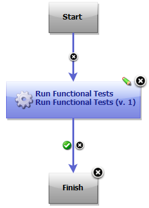

# IBM Rational Functional Tester (RFT) - Usage

### [Example: Running functional tests](#component_process_run)

Use the Rational Functional Tester plug-in to continuously initiate the launch of functional tests from IBM UrbanCode Deploy.

**Before you begin**

* Install the UrbanCode Deploy agent and connect it to the UrbanCode Deploy server. For details, see the UrbanCode Deploy [documentation](http://www-01.ibm.com/support/knowledgecenter/SS4GSP/ucd_welcome.html).
* Install Rational Functional Tester on the UrbanCode Deploy agent computer and apply a valid license. For details, see the Rational Functional Tester documentation.
* Install the UrbanCode Deploy server and deploy the Rational Functional Tester plugin on the server. For information about installing UrbanCode Deploy, see its [documentation](http://www-01.ibm.com/support/knowledgecenter/SS4GSP/ucd_welcome.html).
* Enable the functional testing environment (for example, Java) on the UrbanCode Deploy agent. If you intend to test a web-based application, enable any browser supported by Rational Functional Tester, that is, Microsoft Internet Explorer, Mozilla Firefox, or Google Chrome. See [Software Product Compatibility Reports](http://www-969.ibm.com/software/reports/compatibility/clarity/index.html) for information about the browser versions supported by Rational Functional Tester. For information about enabling the functional testing environment, see [Preparing the functional test environment](http://www-01.ibm.com/support/knowledgecenter/SSBLQQ_8.6.0/com.ibm.rational.test.ft.doc/topics/t_preparerft.html).
* Configure the application to be tested (AUT) on the UrbanCode Deploy agent. For details, see [Configuring applications for testing](http://www-01.ibm.com/support/knowledgecenter/SSBLQQ_8.6.0/com.ibm.rational.test.ft.doc/topics/ConfiguringAppsTesting.html).
* If you have stored the RFT scripts within a folder, the value of the **Script Name** input property should be **folder name.script name**. For example, RFTtests.app1test.

### About the task

As a tester, you might have a large number of regression tests to be run against the latest builds of a product. Instead of manually running the tests against every new build, you can install the latest build on an IBM UrbanCode Deploy Agent computer and let it automatically start the tests for you.

After deploying the Functional Tester plug-in on the UrbanCode Deploy server, create component and its processes, applications and its processes, environments, and resources. For information about how to create and configure these pieces, see the IBM UrbanCode Deploy [documentation](http://www.ibm.com/support/knowledgecenter/SS4GSP/ucd_welcome.html).

### Example: Running functional tests

After deployment, the UrbanCode Deploy plug-in for Rational Functional Tester is available at *Rational Test Workbench > Functional Tester > Run Functional Test* on the UrbanCode Deploy server. The plug-in for Rational Functional Tester includes only a single step:[Run Functional Tests](https://urbancode.github.io/IBM-UCx-PLUGIN-DOCS/UCD/RFT-UCD/steps.html/#run_functional_tests "Run Functional Tests"). The component process runs afunctional script that is part of a Rational Functional Tester project previously stored on an UrbanCode Deploy agent.

To create a workflow, do the following tasks:

1. Click the component process. The Tools view displays the available plugin steps.
2. From Functional Tester, drag the Run Functional Tests step into the design space.
3. Specify the properties for the step. For information about the properties, see the [Steps](https://urbancode.github.io/IBM-UCx-PLUGIN-DOCS/UCD/RFT-UCD/steps.html) page.
4. After configuring the properties, save the step.

A basic process for a functional test plug-in is shown in the following snapshot:

### Note:

* You must compile the functional test scripts in the Eclipse IDE before running them on UrbanCode Deploy.
* The UrbanCode Deploy output variable called **TestResult** contains the overall playback result of the test scripts. This variable helps you view the test results on UrbanCode Deploy itself rather than on the test computer where the scripts are run.
* If the execution of a Rational Functional Tester script is dependent on an external .jar file, make sure you place the .jar file in the **customization** folder. Adding references to the file under project properties (which is what you normally do when playing scripts from the Rational Functional Tester IDE) will not suffice.

Video: Running functional tests
===============================

The following video shows how to use the Rational Functional Tester plug-in for UrbanCode Deploy to remotely run functional tests.

|Back to ...||Latest Version|IBM Rational Functional Tester (RFT) ||||
| :---: | :---: | :---: | :---: | :---: | :---: | :---: |
|[All Plugins](../../index.md)|[Deploy Plugins](../README.md)|[6.1](https://raw.githubusercontent.com/UrbanCode/IBM-UCD-PLUGINS/main/files/RFT-UCD/RFT-UCD-FunctionalTest-6.1.zip)|[Readme](README.md)|[Overview](overview.md)|[Steps](steps.md)|[Downloads](downloads.md)|
