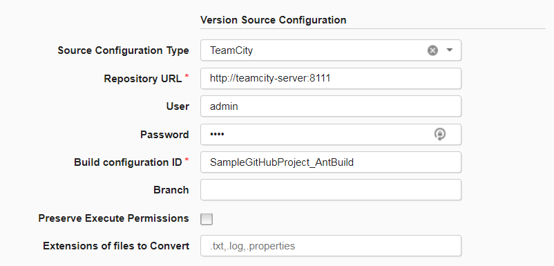
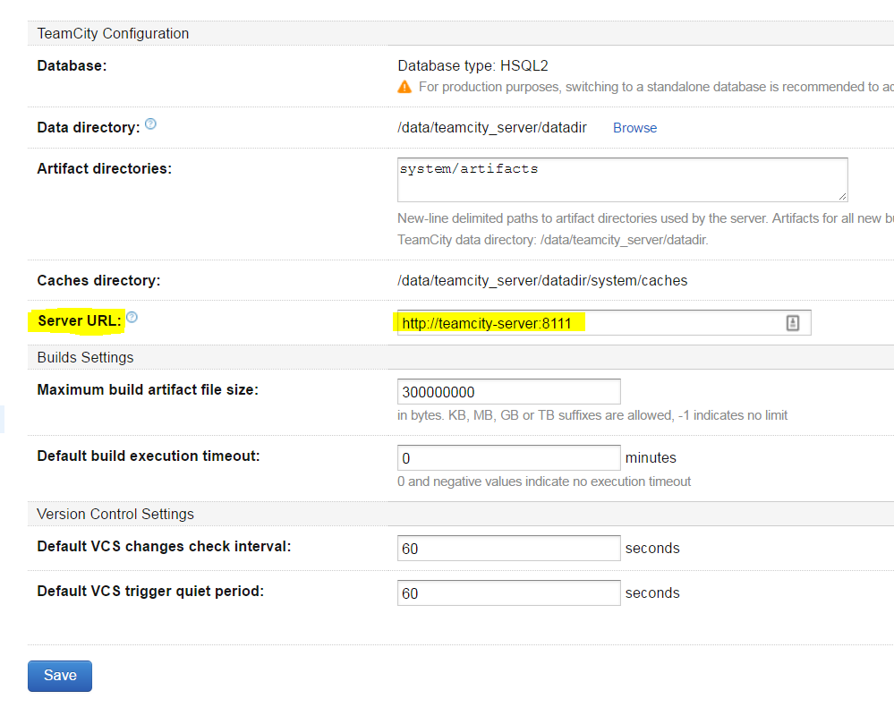

TeamCity - Usage
================

# Usage

### Usage

 

Youll need to define an UrbanCode Deploy component which defines the source and processes for the 
Maven repository. The component contains the information for importing the artifacts and any processes to implement on 
the artifacts.

When creating the component, youll supply information described on the [Import Version](#steps) step. 
After the component is created, use the **Components** page in the user interface to import a version of the artifacts 
if automatic import is not selected.

To create a component, complete the following steps. For more information about 
creating a component, see [Creating 
components](http://www-01.ibm.com/support/knowledgecenter/SS4GSP_7.0.2/com.ibm.udeploy.doc/topics/comp_create.html 
"Creating components") in the product documentation.

1. In UrbanCode Deploy, click **Components** and then click 
**Create Component**.
2. In the Create Component window, specify a name and description for the component.
3. In the 
**Teams** fields, specify the access information for the new component.
4. To use a template for the new component, 
select a template from the Template list. In this case, the component inherits source configuration, properties, and 
processes from the template.
5. In the **Source Config Type** list, select **Teamcity**.
6. Specify the properties for 
the component. See [Steps](#steps) for property descriptions.
7. Click **Save**.

### Import a version

When the 
artifacts are imported, a component version is created using the version of the package. You can specify to import a 
specific package version or import all versions. If importing all versions, a component version is created for each 
version. 

1. Click the **Versions** tab for the component.
2. Click **Import New Versions**.
3. Specify a specific 
version of the package to import, or leave blank to import the latest version of the package available in the 
repository. Additionally, enable **Import All Versions** to import all versions of a package.
4. Click **Save**.

### 
Sample Configuration

 

The TeamCity Source version 10 plug-in contains a number of changes that affect usage. 
Specifically, the **Build Configuration** and **Project** properties have been removed. The **Build Type** property is 
renamed to **Build Configuration ID** to match the intended functionality and to easily identify the Build Project. 

The last build from the `default` branch is imported on each run. If the latest version exists as a component version, 
no import occurs. 

Below are a few screenshots that show a simple configuration of the TeamCity plug-in with 
properties pulled from the TeamCity Server.

### Properties

The following two properties must be specified to 
configure a TeamCity source configuration plug-in. 

* **Repository URL:** The base TeamCity server hostname and port.

* **Build Configuration ID:** The Build Configuration ID that identifies the build project in TeamCity.

The following 
four properties are optional.

* **Branch:** The branch to import artifacts from. Empty value will import default 
branch. `default-any` will import all artifacts regardless of branch.
* **User:** The username to authenticate with 
TeamCity.
* **Password:** The password to authenticate with TeamCity.
* **Preserve Execute Permissions:** Select to 
retain file permissions. Linux and UNIX operating systems only.
* **Extensions of files to Convert:** Specify extensions
 to convert files to local charset.

### Manual Import Properties

Two optional properties are available on manual 
import.

* **Target Build ID:** Specify a build id to import a specific build version. This property can be used to 
import older builds.
* **Version Name:** Rename the component version if imported.

### Sample Configuration

### Repository URL

The Repository URL points the source configuration 
to the TeamCity server. This property is likely the same hostname specified in the internet browser to reach the 
TeamCity instance. It is important to note that this Server URL is also configurable ([JetBrains 
Documentation](https://confluence.jetbrains.com/display/TCD10/Configuring+Server+URL)). The URL can be found by either 
going into TeamCitys `Administration > Global Settings` and viewing the Server URL property or using the URL in your 
browser.

### Administration > Global Settings

### Internet Browser

### Build Configuration ID

The Build Configuration ID specifies the exact 
build project to import as component versions. At the time of this writing, only the default branch can be imported. 
Within TeamCitys REST API, this property is referred to as buildType or buildTypeId, but labeled as the the **Build 
Configuration ID** in the build configuration settings. The ID referred to as its REST API name can be found as a URL 
query parameter while viewing the build project in a browser.

### Build Configuration Settings > General Settings

### Authentication

While some TeamCity servers are open to
 the public to view, realistically your TeamCity server will be protected with a username and password. Specify any 
username and password that has access to a particular project build. The same credentials used to login manually are 
used here.

|Back to ...||Latest Version|TeamCity ||||
| :---: | :---: | :---: | :---: | :---: | :---: | :---: |
|[All Plugins](../../index.md)|[Deploy Plugins](../README.md)|[19.1131552]()|[Readme](README.md)|[Overview](overview.md)|[Steps](steps.md)|[Downloads](downloads.md)|
