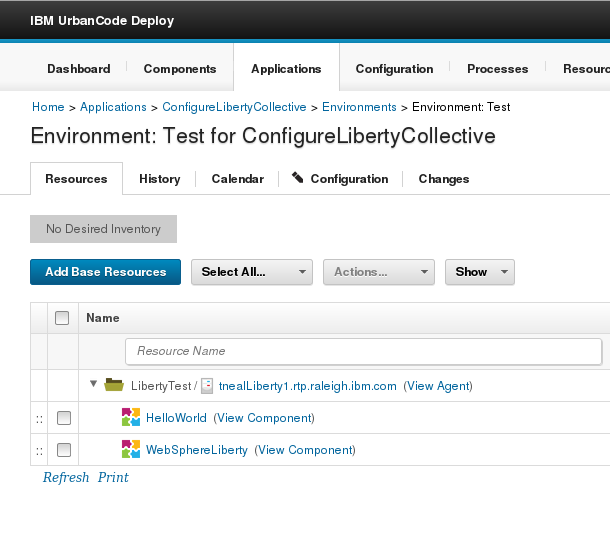
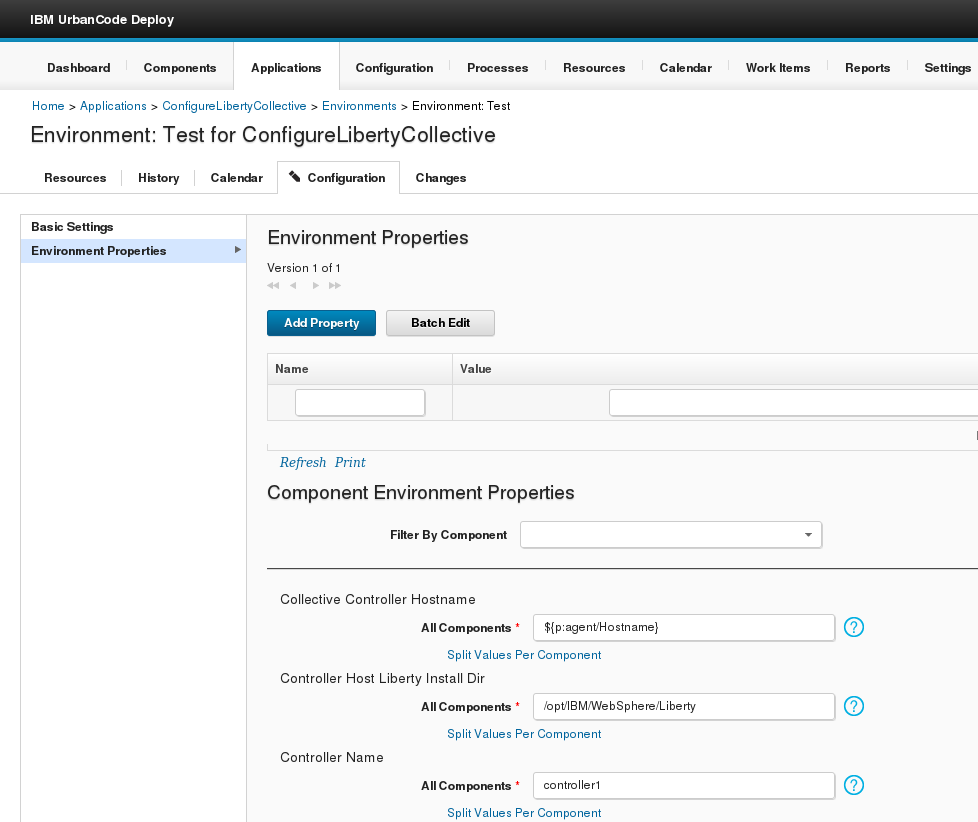
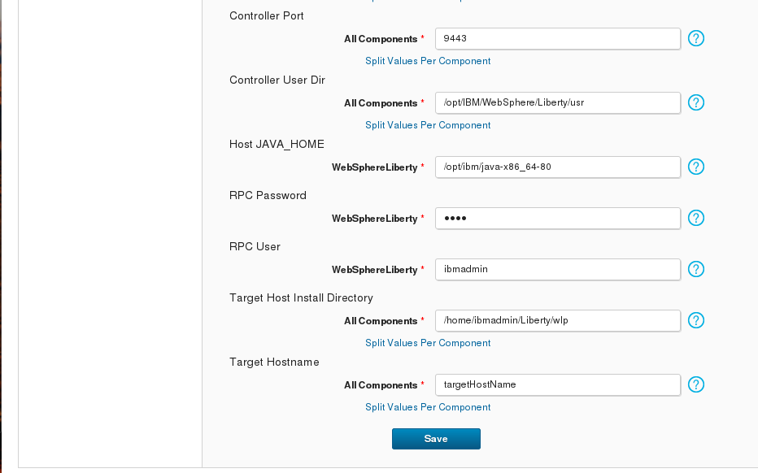
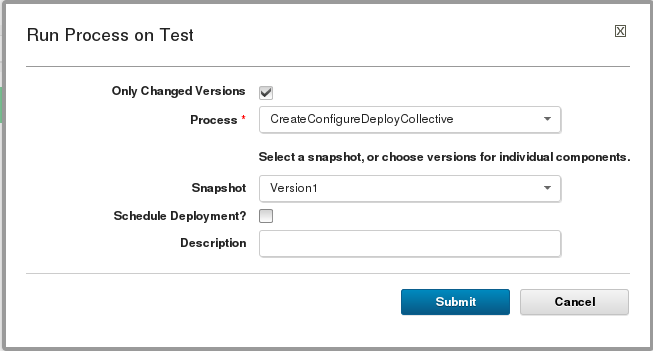
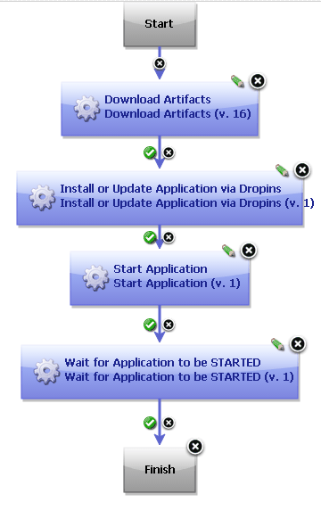

# IBM WebSphere Liberty - Usage

## Usage

- [IBM WebSphere Liberty - Usage](#ibm-websphere-liberty---usage)
  - [Usage](#usage)
    - [Example: Creating a collective and installing a simple application](#example-creating-a-collective-and-installing-a-simple-application)
    - [Example: Installing an application on WebSphere Application Server Liberty Profile](#example-installing-an-application-on-websphere-application-server-liberty-profile)

### Example: Creating a collective and installing a simple application

The [CreateCollectiveSampleApp.zip](https://github.com/UrbanCode/IBM-UCD-PLUGINS/blob/main/files/WebSphereLiberty/SampleApplications/CreateCollectiveSampleApp.zip.txt) file contains an example IBM UrbanCode Deploy application that creates a WebSphere Liberty collective and deploys a simple web application to the servers in the collective. The sample application runs processes to complete the following tasks:

* Create a Liberty server and collective.
* Register a target host with the collective.
* Upload a Liberty package file to the registered host.
* Join Liberty member servers from the package file to the collective.
* Start collective member servers.
* Deploy a simple application to the collective servers.

The example IBM UrbanCode Deploy application assumes that you have two hosts. One host (the collective controller host) must be running the IBM UrbanCode Deploy agent software and also must have WebSphere Liberty installed.

See this example in action in a video: [Create a WebSphere Liberty collective and deploy applications using UrbanCode Deploy](https://www.youtube.com/watch?v=VaYQE5d96hY&feature=youtu.be).

Import the example application archive to your IBM UrbanCode Deploy server. When you import the application, select **Import with Snapshots**.

After you import the example application archive, complete the following steps.

1. Create a top-level resource directory, and then add the agent that is running on the collective controller host to the new top-level resource.
2. Add the WebSphereLiberty and HelloWorld components under the agent, as shown in the following screen capture:
3. Go to the Test environment of the ConfigureLibertyCollective application, and then click **Add Base Resources** to add the new resource tree as the base resource of the Test environment, as shown in the following screen capture:
4. Set the environment properties for the Test environment so that the values are correct for your specific environment. Change the values for all properties other than the **Collective Controller Hostname**, **Controller Name**, and **Controller Port** properties. Click the **Configuration** tab for the Test environment, and then click **Environment Properties** to set the values. After you enter all of the property values, click **Save**.
5. You can now run the CreateConfigureDeployCollective application process on the Test environment. In the Run Process window, select the Version1 snapshot.

The process runs and installs the HelloWorld application to the member servers of the Liberty collective. Browse to the following URLs to see the output of the HelloWorld applications. The application output is Hello Tom.

* https://*targetHostName*:9444/HelloWorld/Hello
* https://*targetHostName*:9445/HelloWorld/Hello
* https://*targetHostName*:9446/HelloWorld/Hello

You can also see information about the new collective by adding the Liberty Admin Center feature to the `server.xml` file for the controller1 server. On the collective controller host, add the following line to the `*LibertyInstallDir*/usr/servers/controller1/server.xml` file:

`<feature>adminCenter-1.0</feature>`

Browse to the following URL to access the Liberty Admin Center:

https://*CollectiveControllerHost*:9443/adminCenter

Log in to the Liberty Admin Center. For the sample application, the default administrator ID is `admin` and the default password is `adminpwd`. Click the **Explore** icon and to display the applications, servers, and other information that is associated with the collective that the sample application created.

### Example: Installing an application on WebSphere Application Server Liberty Profile

The following component process installs a Java EE application on the WebSphere Application Server Liberty Profile. In this example, the application binary files are in the component. Also, the environment contains an installation of the Liberty profile and a server that is running. The process runs the following steps in order:

1. The Download Artifacts step retrieves the binary files.
2. The [Install or Update Application with Drop-ins](#install_or_update_applications_with_dropins) step installs the application.
3. The [Start Application](#start_application) step starts the application.
4. The [Wait for Application to be STARTED](#wait_for_application_to_be_started) step pauses the process until the application starts.

A component process that uses the steps in the Liberty Profile plug-in to install an application

|Back to ...||Latest Version|IBM WebSphere Liberty |||||
| :---: | :---: | :---: | :---: | :---: | :---: | :---: | :---: |
|[All Plugins](../../index.md)|[Deploy Plugins](../README.md)|[21.1100824](https://raw.githubusercontent.com/UrbanCode/IBM-UCD-PLUGINS/main/files/WebSphereLiberty/WebSphereLiberty-21.1100824.zip)|[Readme](README.md)|[Overview](overview.md)|[Troubleshooting](troubleshooting.md)|[Steps](steps.md)|[Downloads](downloads.md)|
