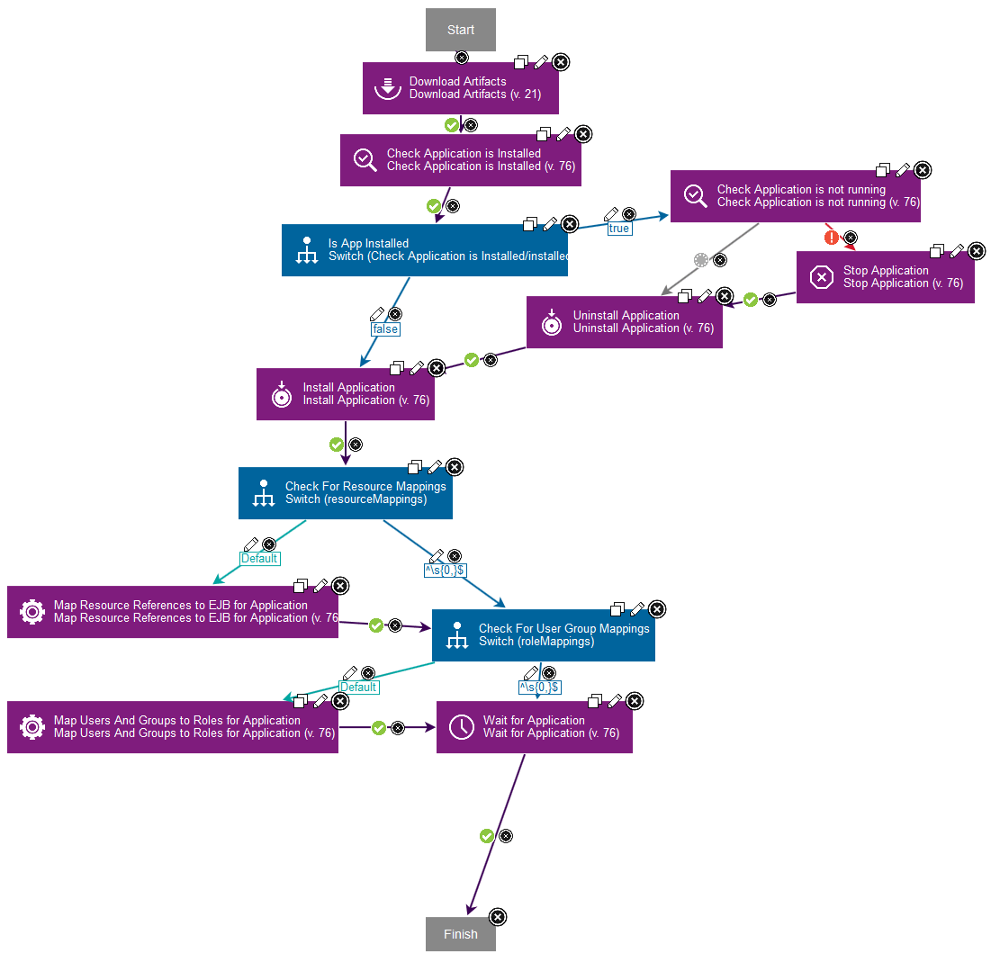

WebSphere Application Server – Deployment - Usage
=================================================

# Usage

### Usage

* [Specifying multiple profiles with the websphere.profilePath property](#specifying-multiple-profiles-
with-the-websphere-profilepath-property)
* [Deploying WebSphere applications to multiple clusters in the same 
cell](https://www.urbancode.com/resource/deploying-websphere-applications-to-multiple-clusters-in-the-same-cell/)
* 
[Example: Installing the PlantsbyWebSphere application](https://www.urbancode.com/resource/example-installing-the-
plantsbywebsphere-application/)

Specifying multiple profiles
----------------------------

If you have multiple 
profiles defined for your WebSphere installation, you may discover all the profiles by using one of the following 
methods:

 

 

### Specify websphere.profilePath property

 

 

Specify multiple profiles to collect information
 for multiple cells, either for the top-level group or for the agent.

You specify multiple profiles during deployment.
 You specify them in a `websphere.profilePath` property in 1 of 2 places:

* *Top-level group*: Set the 
`websphere.profilePath` here to collect profiles from multiple cells that are deployed across multiple hosts. All hosts 
must use the same installation directory for the cell.
* *Agent*: Set the `websphere.profilePath` here to collect 
profiles for multiple profiles on the same host.

#### Values for the websphere.profilePath property</h4

Specify one 
or more paths as the property value. Separate multiple paths with a comma. The paths can be one of the following types:

* A path to a profile. The path does not have to specify `/bin/wsadmin.sh`, but autodiscovery works with paths that 
do.
* A path to a container directory of profiles. In this case, the autodiscovery code loops over each first-level 
directory. It registers base and ND profiles. It skips node and server profiles.

When you specify multiple profiles, 
the following values are read during autodiscovery:

* SOAP port (read from `portdef.properties`)
* profile path
* 
installation path

Example value with two container directories and one profile 
path:`"/opt/IBM/WebSphere/Profiles/,/opt/WAS/Profiles,/opt/IBM/profiles/dmgr"`

Note: If you specify multiple container
 directories, no duplicates are allowed in the profile names that the directories contain. If autodiscover finds the 
same profile name, it overwrites the previously found profile name.

Example: `/opt/IBM/WebSphere/Profiles` and 
`/opt/WAS/Profiles` both contain a `dmgr` profile. A resource is created only for the second `dmgr` resource because the
 first profile is overwritten.

If you encounter this situation, you can work around it by creating a separate top-
level group and segregate the profile directories.

 

 

### Specify wsadmin.path property

 

 

Starting in 
version 109, you can also discover multiple profiles if you specify the following property: **wsadmin.path** on the 
Agent and make it refer to the wsadmin command located in the installation directory of WebSphere Application Server, as
 follows:

* Navigate to Resources > Agents
* Select the desired Agent name
* Select Configuration > Agent properties
*
 Add the property: **wsadmin.path** with the value: *WAS\_HOME*\bin\wsadmin.bat or *WAS\_HOME*/bin/wsadmin.sh where 
*WAS\_HOME* is the installation directory of WebSphere Application Server.

In this case, all the profiles listed in 
*WAS\_HOME*\properties\profileRegistry.xml will be discovered.

If you specify the path to the wsadmin command 
contained in one specific profile, only that profile will be discovered.

**NOTE:** The websphere.profilePath property 
takes precedence over the **wsadmin.path** property if both are specified.

### Do not specify any properties

If you 
do not specify any properties, the plugin will attempt to discover all the profiles contained in the profileRegistry.xml
 file, assuming the default installation path of WebSphere Application Server for that operating system.

#### Example:
 Installing an EAR file on WebSphere Application Server

The plug-in now includes component templates. The component 
templates include processes and properties for working with WebSphere Application Server. See [Using component 
templates](http://www-01.ibm.com/support/knowledgecenter/SS4GSP_7.1.1/com.ibm.udeploy.doc/topics/comp_template_using.html)
 in the product help. If you create a component from the WebSphere Enterprise Application template, you can use the 
Deploy EAR With User/Group Mappings, Resource Mappings process in the template to install the EAR file. The process uses
 switch steps as needed to test property values. See [Switch 
steps](http://www-01.ibm.com/support/knowledgecenter/SS4GSP_7.1.1/com.ibm.udeploy.doc/topics/comp_process_switch.html) 
in the product help. The Deploy EAR With User/Group Mappings, Resource Mappings process runs the following steps:

1. 
The **Download Artifacts** step retrieves the binary files.
2. The **Check Application is Installed** step tests whether
 the application is already installed.
3. The **Is App Installed switch** step tests the installed output property from 
the **Check Application is Installed** step and branches accordingly.
4. If the application is already installed, the 
**Check Application is not running**, **Stop Application**, and **Uninstall Application** steps run as needed to stop 
and uninstall the application.
5. The Install Application step installs the application.
6. The Check For Resource 
Mappings switch step tests the resourceMappings property and branches accordingly.
7. The **Map Resource References to 
EJB for Application** step updates the resource reference mappings.
8. The **Check For User Group Mappings switch** step
 tests the roleMappings property and branches accordingly.
9. The **Map Users And Groups to Roles for Application** step
 maps users to roles.
10. The **Wait for Application** step introduces a delay to allow time for the application to 
start.

|Back to ...||Latest Version|WebSphere Application Server – Deployment |||||||
| :---: | :---: | :---: | :---: | :---: | :---: | :---: | :---: | :---: | :---: |
|[All Plugins](../../index.md)|[Deploy Plugins](../README.md)|[127.1131367]()|[Readme](README.md)|[Overview](overview.md)|[User permissions](user permissions.md)|[Steps](steps.md)|[Roles](roles.md)|[Troubleshooting](troubleshooting.md)|[Downloads](downloads.md)|
