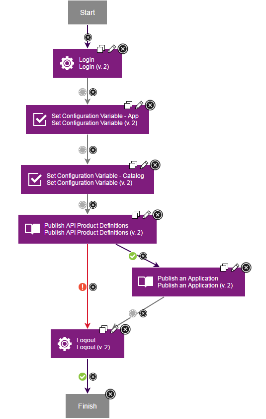
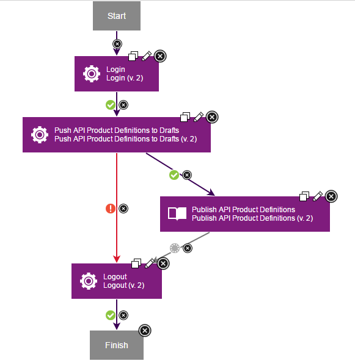

IBM API Connect - Usage
=======================

# Usage

### Usage

To understand how to use the API Connect plug-in this topic uses two component templates that are available. The information in this topic is also available through a video, to watch the video, go to the [Using the API Connect plug-in](#video-walkthrough).

The two available templates are located in the [UrbanCode Templates](https://github.com/UrbanCode/Templates-UCD) GitHub repository under IBM API Connect/Component.

* Publish Loopback Application
* Release API Product Definitions from Drafts

The API Connect templates provide a starting point for understanding the IBM API Connect plug-in.

The templates use the online version of BlueMix and requires a valid BlueMix account. See [Build for free on IBM Cloud](https://console.ng.bluemix.net/registration/) website to create a trial BlueMix account account. The templates requires some prerequisite steps to publish your first definition or project.

To use the plug-in, the apiconnect (apic) command line toolkit must be installed. For installation information, see [Installing the toolkit](https://www.ibm.com/support/knowledgecenter/SSMNED_5.0.0/com.ibm.apic.toolkit.doc/tapim_cli_install.html) topic in the product documentation.

The directions below to demonstrate how to deploy your applications through UrbanCode Deploy.

### API ConnectPublish Loopback Application

####

The Publish Loopback Application process takes a previously created Loopback application and publishes it to an API Connect instance. The catalog and application must be previously created on API Manager. Log into your [Bluemix account](https://new-console.ng.bluemix.net/apis/apiconnect) for API Manager. Follow the prerequisite steps to prepare an application for deployment. If the prerequisite steps are followed, many of the predefined values in the template are untouched.

#### Prerequisites

The following prerequisites must be completed.

1. To create a loopback application, follow the steps in the [Creating a LoopBack project from the command line](https://www.ibm.com/support/knowledgecenter/SSMNED_5.0.0/com.ibm.apic.toolkit.doc/tutorial_cli_project_create.html?cp=SSMNED_5.0.0%2F1-2-0-1-0&lang=en) which is part of the IBM API Connect documentation. After the steps are complete, the final application name and local folder is acme-bank. Make note of the path to the folder. This information is needed later.
2. To create a catalog and app on API Manager, follow the first set of steps one through eight [Publishing a project from the command line](https://www.ibm.com/support/knowledgecenter/SSMNED_5.0.0/com.ibm.apic.toolkit.doc/tutorial_cli_project_stage_command.html?cp=SSMNED_5.0.0%2F1-2-0-1-4&lang=en). It is not necessary to save the catalog and application identifiers. When completed,
* The name of the Catalog is Sandbox, with an ID of sb
* The name of the Application is Acme Bank, with an ID of acme-bank**Note:** Do not follow any steps that point to using the command line.

#### UrbanCode Deploy steps

After the prerequisites are completed, the following tasks are done in UrbanCode Deploy.

1. In the UrbanCode Deplpoy interface install the IBM API Connect plug-in. Click **tt>Components** and then the **Templates** tab. The **API ConnectPublish Loopback Application** template should be in the template list. Open the template.
2. Click **Create Component**.
3. Fill out the form. If the prerequisite steps were followed, many of the required fields can be ignored or require minimal modifications. Specifically,  refers to the path leading up to the required folder or definition. This is the location where the application was created in the create application prerequisite step. The Organization is a modification of your user name. If you are unsure, it can be found in the API Manager console. Update the username and password with your credentials. If the prerequisite steps were not followed, all of the required fields must be edited.
**Note:** While the **Version Source Configuration** is required, it is ignored in this template process.
4. Click **Save**.
5. Create a new application, attach the newly created Component, assign the Component an agent resource, and run the **Publish Loopback Application** process.
6. You can verify the newly published Loopback application by viewing the products within the **Sandbox** catalog on the API Connect console.

**Note:** In apic version 1.0.2, you may experience an authentication error when deploying a Loopback app. If so, refer to the troubleshooting page to resolve the issue.

#### Template Process

This template is composed of six steps:

1. Login
2. Set Configuration VariableApp
3. Set Configuration VariableCatalog
4. Publish API Product Definitions
5. Publish an Application
6. Logout

### API ConnectRelease API Product Definitions from Drafts

###
The Release API Product Definitions from Drafts template takes a previously definition YAML file, saves it to Drafts, and then publishes it to an API Connect instance. The catalog and application must be previously created on [API Manager](https://new-console.ng.bluemix.net/apis/apiconnect).

#### Prerequisite Steps

The following prerequisites steps prepare a definition for deployment. If the prerequisite steps are followed, many of the templates predefined values may be left untouched.

1. Create an API definition from the command line. You can use the directions in the [Creating a LoopBack project from the command line](https://www.ibm.com/support/knowledgecenter/SSMNED_5.0.0/com.ibm.apic.toolkit.doc/tutorial_cli_project_create.html?cp=SSMNED_5.0.0%2F1-2-0-1-0&lang=en) topic.
2. Open a command line interface and issue the following commands:
1. `apic create --type api --title Loans` to create a sample local `.yaml` definition.
2. `apic validate loans.yaml` to validate that the `.yaml` definition file was created correctly.
3. `apic create --type product --title "Banking Services" --apis loans.yaml` to create the final product definition named: banking-services.yaml. Record the location of this file, this information is needed later.
3. Create a catalog on API Connect. Follow the first set of steps one through four [here](https://www.ibm.com/support/knowledgecenter/SSMNED_5.0.0/com.ibm.apic.toolkit.doc/tutorial_cli_project_stage_command.html?cp=SSMNED_5.0.0%2F1-2-0-1-4&lang=en). It is not necessary to save the catalog and application identifiers. When completed, the name of the Catalog is Sandbox, with an ID of sb. The same Sandbox catalog may be reused if it has been previously created.

#### UrbanCode Deploy steps

After the prerequisites are completed, the following tasks are done in UrbanCode Deploy.

1. In the UrbanCode Deploy user interface, install the IBM API Connect plug-in, click the **Components**, and then the **Templates** tab. The **API ConnectRelease API Product Definitions from Drafts** template should be in the template list. Enter the template.
2. Click the **Create Component**.
3. Fill out the form. If the prerequisite steps were followed, many of the required fields can be ignored or require minimal modifications. Specifically,  refers to the path leading up to the API product definition. This is the location where the product was created in the prerequisite steps. The Organization is a modification of your username. If you are unsure, it can be found in the API Manager console. Lastly, update the username and password with your credentials. If the prerequisite steps were not followed, all of the required will need to be edited.
**Note:** While the Version Source Configuration is required, it is ignored in this template process.
4. Click **Save**.
5. Create a new Application, attach the newly created Component, assign the Component an agent resource, and run the **Release API Product Definitions from Drafts** process.
6. The newly published API product definition can be verified by viewing the products within the Sandbox catalog on the API Connect console.

**Note:** The `loans.yaml` file created in the prerequisite steps, might not have the correct gateway assigned causing an error to occur while pushing or publishing a API definition. Refer to the troubleshooting page to resolve this issue.

#### Template Process

This template is composed of four steps:

1. Login
2. Push API Product Definitions to Drafts
3. Publish API and Product Definitions
4. Logout

|Back to ...||Latest Version|IBM API Connect ||||||
| :---: | :---: | :---: | :---: | :---: | :---: | :---: | :---: | :---: |
|[All Plugins](../../index.md)|[Deploy Plugins](../README.md)|[7.1022553](https://raw.githubusercontent.com/UrbanCode/IBM-UCD-PLUGINS/main/files/apiconnect/apiconnect-7.1022553.zip)|[Readme](README.md)|[Overview](overview.md)|[Tutorials](tutorials.md)|[Steps](steps.md)|[Troubleshooting](troubleshooting.md)|[Downloads](downloads.md)|
