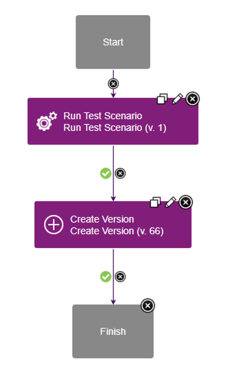
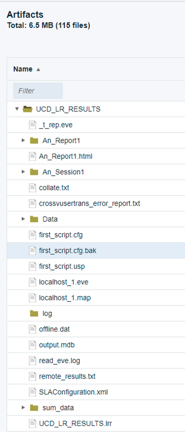
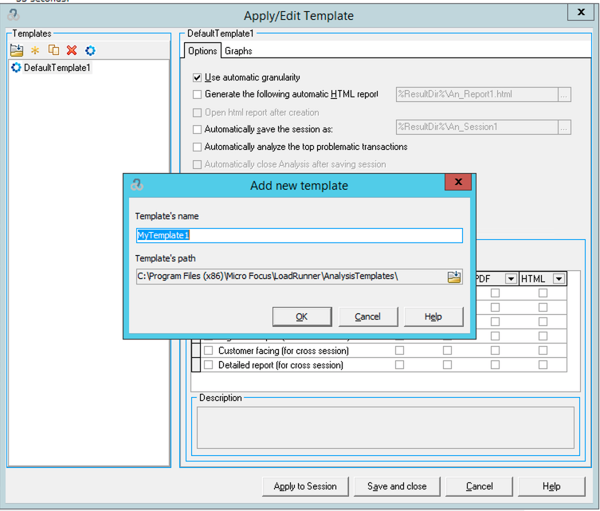
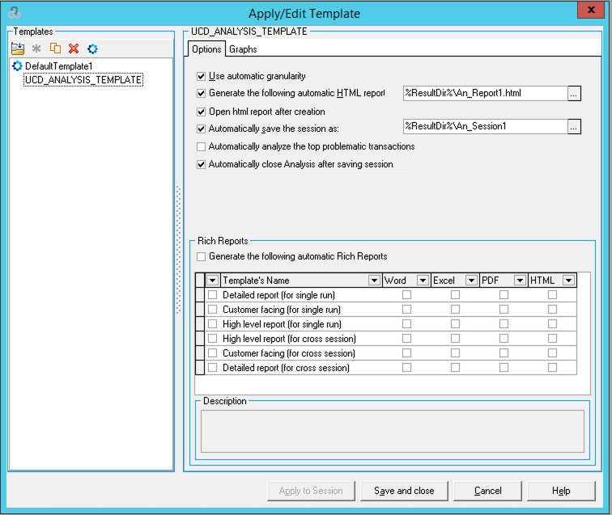

HP LoadRunner - Usage
=====================

# Usage

### Usage

 

* [Default UCD Analysis Template](#default-ucd-analysis-template)
* [Customizing Analysis 
Templates](#customizing-analysis-templates)
* [Uploading Reports to Codestation](#uploading-reports-to-codestation)

### Uploading Reports to Codestation

 

After the Run Test Scenario step successfully executes you can utilize the 
IBM UrbanCode Deploy Versions plugin to upload the results to code station. This plugin is installed by default in the 
UrbanCode Deploy server, so theres not need to install it separately.

When the HP LoadRunner plugin runs analysis on 
the test results it creates a folder inside of the steps working directory. This folder holds all of the reports 
generated during analysis. It also holds the files used to run the analysis, including the LRR (LoadRunner Results) 
file. The name for this directory will be determined by the value specified in the LoadRunner Results Name field of the 
plugin step.

Here is the default configuration for the Run Test Scenario step: 

Using this default configuration youll 
find the analysis results in the UCD\_LR\_RESULTS directory in your agents working directory. The default analysis 
template UCD\_ANALYSIS\_TEMPLATE generates an HTML report called An\_Report1.

Note that if you were to provide a 
different working directory, the folder would be created there instead of in the <agent\_install\_dir>/var/work/ 
directory. 

To upload the report generated in this folder to codestation, you can utilize the Create Version step of 
the IBM UrbanCode Deploy Versions plugin. Further documentation on this step can be found in the [IBM UrbanCode Deploy 
Versions steps document](https://www.urbancode.com/plugindoc/ibmucd/ibm-urbancode-deploy-
versions/60-455054/steps/#create_version).

In this example I am creating a new version to hold the reports. For this reason 
the component process that I have designed is an operational process that does not require an already created version to
 run. It is possible to use a similar approach with a deployment type component process, and modify the component 
version that is being used for the deployment. This approach would require usage of the udclient command-line utility, 
or the UCD REST API directly. For more information please see the [addVersionFiles documentation 
page](https://www.ibm.com/support/knowledgecenter/SS4GSP_7.0.1/com.ibm.udeploy.api.doc/topics/udclient_addversionfiles.html).

In the Create Version steps configuration youll need to specify a name for the component, the version name, and the 
files to include. In this example I am using the current component as the component to create the new version on, by 
referencing the component.name property. 

As Ive stated, this process will be executing without a component version. I have 
instead, created a version.name property as an application process property. When the application process is run, it 
will prompt for a version name. As you can see above, that version.name property is being used to create the new 
component version.

The Includes field will determine which files and directories will be published to the new 
component version. I have chosen to include everything in the results directory.

After this process runs, a new version 
is created on the component with the name that Ive specified for the version.name application process property at 
runtime. This new version contains everything generated in the results directory. This includes all reports and results 
files. You can further specify exactly which reports and directories you want to create on the version in the Includes 
field of the Create Version step.

### Customizing Analysis Templates

 

The HP LoadRunner plugin allows you to
 specify custom defined analysis templates. You may need to use a custom analysis template if:

* You are unable to 
give the agent user permissions to the LRAnalysis80.ini file. Please see the [Default UCD Analysis Doc](#default-ucd-
analysis-template) for more information.
* You require specialized graphs or different report file types to be 
generated.

Before you can create your own custom HP LoadRunner Analysis template youll need to generate a MicroFocus 
LoadRunner Result File (LRR).

You can generate a MicroFocus LoadRunner Result File in one of two ways:

1. Run the HP
 LoadRunner plugin
        * This will generate the LRR file in your plugin steps working directory under a subdirectory
 of the name youve specified for the plugin steps LoadRunner Results Name field.
        * For instance, if you use the 
default working directory of a component named LR Test and specify the plugin steps LoadRunner Results Name as the 
default UCD\_LR\_RESULTS, youll find the UCD\_LR\_RESULTS.lrr file located in the following directory: 
2. Run your Test Scenario in the HP 
LoadRunner Controller directly
        * You can find more information for running HP LoadRunner Test Scenarios from the
 Micro Focus [Running Scenarios in 
Controller](https://admhelp.microfocus.com/lr/en/12.60/help/WebHelp/Content/Controller/toc_running_scenarios.htm) 
documentation.

### Creating the analysis template in HP LoadRunner

After you open the LRR file in your HP LoadRunner
 Controller you can open the templates tool under the tools tab.

From here youll select to add a new 
template and give it a name. It should be noted that it is a bad idea to select UCD\_ANALYSIS\_TEMPLATE as your new 
template name. If youve ever run the plugin with the default UCD\_ANALYSIS\_TEMPLATE template that is provided with the 
plugin, creating a new template of the same name will overwrite the imported one in HP LoadRunner. Also, if you intend 
to run with the plugins UCD\_ANALYSIS\_TEMPLATE in the future it will overwrite your custom made template of the same 
name.

After you create the
 new template you can configure all of the report generation options that you desire. Two of the options that you need 
to configure for the plugin to work with your custom template are the Automatically save the session as and 
Automatically close Analysis after saving session. If these two boxes arent checked your plugin step will continue 
executing until you go into the machine and manually close the Analysis tool.

To use the template in the plugins Run 
Test Scenario step, you can specify the name that youve created the template with for the Template Name field. This will
 run the specified test scenario and then run the analysis using your custom analysis template.

### Default UCD Analysis Template

 

This plugin comes with a predefined HP LoadRunner analysis template called UCD\_ANALYSIS\_TEMPLATE. Specifying 
this template for the plugin steps Template Name field will automatically install and use the template for analysis. 
UCD\_ANALYSIS\_TEMPLATE is also set as the default value for the Template Name field.

In order to use the default template, 
the agent user must have privileges to read and write to the LRAnalysis80.ini file. This configuration file can be found
 at the following system path <LoadRunnerInstallDir>\config\LRAnalysis80.ini.

After executing this step youll notice a
 new template in your LoadRunner Analysis tool. Open the LoadRunner Analysis tool and click on templates under the tools
 tab.

You can view all of 
the preconfigured settings of the UCD\_ANALYSIS\_TEMPLATE. It should be noted that any manual changes to this template 
will be overwritten when the plugin step runs again. For this reason, if you require a more custom template you may 
create your own and specify the name in the plugin step. Please see the plugin document entitled Customizing Analysis 
Templates for more information on using custom templates.

After the step runs it will generate an HTML report file called An\_Report1.html in
 your working directory. This directory will be the components working directory in the UCD agent by default.

|Back to ...||Latest Version|HP LoadRunner ||||
| :---: | :---: | :---: | :---: | :---: | :---: | :---: |
|[All Plugins](../../index.md)|[Deploy Plugins](../README.md)|[1.1004896](https://raw.githubusercontent.com/UrbanCode/IBM-UCD-PLUGINS/main/files/hp-loadrunner/plugins-hp-loadrunner-1.1004896.zip)|[Readme](README.md)|[Overview](overview.md)|[Steps](steps.md)|[Downloads](downloads.md)|
