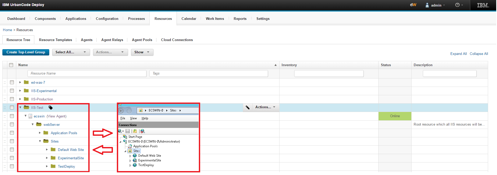
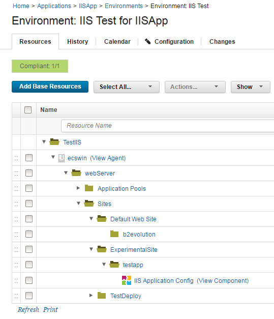
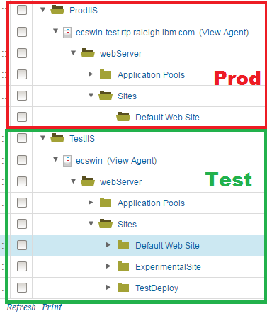

Microsoft IIS – Configure - Usage
=================================

# Usage

### Usage

 

* [Discovering and applying configurations](https://www.urbancode.com/plugindoc/ibmucd/iis-
configuration/1-2/usage/discovering-and-applying-configurations/)
* [Comparing configurations with live IIS 
instances](https://www.urbancode.com/plugindoc/ibmucd/iis-configuration/1-2/usage/comparing-configurations-with-live-
iis-instances/)

### Comparing configurations with live IIS instances

 

You can use the live comparison feature 
of the IIS Configure plug-in to compare the properties from previously discovered IIS configurations against the current
 live configuration. A live comparison shows the specific properties that changed, which can help you investigate 
problems with the current configuration. Differences in the stored configuration versus the live configuration are 
sometimes known as *configuration drift*.

### Before you begin

* Discover an existing IIS configuration and store 
the configuration as component version in IBM UrbanCode Deploy. For more information, see [Discovering and applying 
configurations](https://www.urbancode.com/plugindoc/ibmucd/iis-configuration/1-2/usage/discovering-and-applying-
configurations/).
* Change several properties in either the live IIS configuration or in the component version so that 
the changes can be detected during a comparison.

### Running the live comparison

Map the relevant component to your 
application environments resource tree, as shown in **Figure 1**. The comparison process skips the request if you do not
 have a component that is mapped to the resource tree. The application process iterates through each component in the 
resource tree. For each component in the resource tree, the version that you select is compared to the live 
configuration.

In IBM UrbanCode Deploy, go to the Applications page. Click the example IISApp application. Click the 
deployment push button on the environment where you want to run the live comparison. From the **Process** list, select 
**Live Compare**. Select the version or versions from multiple components to compare against the live configuration. If 
you select multiple component versions, they are compared sequentially. Ensure that **Only Changed Versions** is 
cleared. For an example of the Run Process window, see **Figure 2**. Click **Submit**. The live comparison process runs.
 Typically, it can take several seconds to run the comparison, depending on how much configuration data is stored.

Figure 
1. IIS application component that is mapped to the resource tree.

Figure 2. The Run Process window for a live comparison process.

### Analyzing changes

After the live comparison process completes, you can review and analyze the results. Click 
the **History** tab in the IISApp application to return to the process request window. Click **View Request** in the 
Actions column to return to the last request that you made.

To view the configuration drift, expanding the child 
objects of the process request until the IIS Configuration Live Comparison plug-in step is displayed. When you hover 
your mouse pointer over this row, a compare icon is displayed at the right side of the Step column. Click the compare 
icon. Any changes between the version that you selected and the current live configuration are displayed here, 
highlighted in yellow and orange. To view the full comparison tree that includes unchanged assets, clear **Only Show 
Changes** at the upper left. See **Figures 3-5** for visual reference.

Figure 3. The compare icon on the process request page.

Figure 4. The Differences window that is displayed after you 
click the compare icon. The arrow points to the link to view changed properties.

Figure 5. The Compare Properties window that is displayed after you 
click View Properties. The Compare Properties window shows the changed properties.

### Result

You compared a 
previously discovered configuration to the live configuration. You can use this feature to detect unexpected changes to 
your live configuration, and to detect changes that were made since your previous component version. After you determine
 exactly which properties changed, you can fix any problems that occurred because of those changes.

### Discovering 
and applying configurations

 

You can use the IIS Configure plug-in to manage IIS configurations with IBM 
UrbanCode Deploy. The plug-in includes steps to discover configurations and package them into .zip files by using 
Microsoft Web Deploy, which is integrated into the plug-in. You can modify the configuration file in the .zip archive 
file by using tokenization steps that the plug-in provides. After you modify a configuration, you can apply it to the 
original environment or to a different environment. You can work with entire IIS configurations, or at a specific scope 
such as Sites, Apps, or App Pools.

The following steps describe a standard process of discovery, tokenization, and 
application.

1. Create a resource topology in IBM UrbanCode Deploy that models the IIS topology.
2. Discover an 
existing IIS configuration, and store the configuration as component versions in IBM UrbanCode Deploy.
3. Tokenize 
properties in the configuration so that the configuration is specific for your individual environments.
4. Apply the 
modified configuration to a new environment and examine the result.
5. Test the new environment to confirm that the 
configuration was applied successfully.

### Prerequisites

* 2 Windows computers that are running IIS and Microsoft 
Web Deploy.
* A preconfigured, working application installed on one computer.
* IBM UrbanCode Deploy agents that are 
installed and running on both computers and connected to an IBM UrbanCode Deploy server.
* The IIS Configure plug-in 
running on the IBM UrbanCode Deploy server. For more information, see [Installing plug-ins in UrbanCode 
products](https://www.urbancode.com/resource/installing-plug-ins-in-urbancode-products/).

### Procedure

### Create a
 resource tree topology

Create a top-level group in the resource tree in IBM UrbanCode Deploy. The top-level group is 
the backbone of the resources that represent the IIS environment. In the following example screen capture, the top-level
 group is called `IIS-Test`.

Add the agent that is running on the computer where the preconfigured working application
 is installed (the computer to discover the configuration from). Hover your mouse over the new top-level group, and then
 select **Actions > Add Agent**.

Wait 10 seconds while the automatic discovery process runs, and then click 
**Refresh** at the lower left of the resource tree pane. A new resource role that is called webServer is displayed as a 
child of the agent. An example resource tree is shown in **Figure 1**.

Figure 
1. The resource tree with top-level group, agent, and discovered webServer object.

Click the **Edit** icon for the 
webServer resource role and verify that the properties are set correctly for the computer, and then click **OK**.

For 
the webServer object, click **Actions > Configure using IIS Configuration Configure**. The Configure step runs and 
creates the rest of the topology in UrbanCode Deploy. After the Configure step completes, a topology is displayed that 
matches your IIS topology. An example topology is shown in **Figure 2**.

Figure
 2. The resource tree with full topology (left) after the configure step completes. On the right, the topology on IIS 
Manager for comparison. The topologies should match.

### Discover an IIS configuration

After you set up the IIS 
topology on the resource tree in IBM UrbanCode Deploy, you can discover the configuration from your IIS computer. You 
use a generic process to discover the configuration of an application on the IIS computer. After you discover a 
configuration, you can use the `Tokenize Configuration File` plug-in step to create variables in the configuration file.

The plug-in includes two example generic processes. The following example uses the `Example 2: IIS App Discovery (IIS
 APPS ONLY)` process. This process is designed to first discover the configuration of the application that you choose, 
then tokenize some values in the configuration file, and then upload the modified configuration package to a component 
version.

First, go to Processes. Then, click `Example 2: IIS App Discovery (IIS APPS ONLY)`. Click **Set** for the 
resource, and then select the IIS application to discover from the resource tree. Click **OK**, and then click 
**Submit** if you do not want to specify other options. After the process completes, your configuration file is uploaded
 to a component version in the `IIS Application Config` component, which is loaded when you install the plug-in.

The 
generic process includes the `Tokenize Configuration File` step. If you click the console output icon (at the right of 
the row), you can see that the applicationPool property was replaced with the @applicationPool@ token. When you deploy 
this application to a new environment, you can replace that token with an application pool of your choice by using IBM 
UrbanCode Deploy properties.

### Deploy an application to a new environment

You can now apply the configuration to a
 new environment. The first step is to attach the `IIS Application Config` component to the topology resource tree that 
you created previously.

Go to the Applications page. The IISApp application is automatically installed when you 
install the plug-in. Click the IISApp application. Three example environments are displayed. In this example, you use 
two of the environments, IIS Test and IIS Prod. To set up the IIS Test environment, click the IIS Test environment to 
open the environment resource pane. Click **Add Base Resources**, and then select the entire topology that you 
discovered previously. After you add base resources from the topology, the resource tree looks similar to the tree shown
 in **Figure 3**.

Figure 3. The resource tree in the IIS Test environment 
after you add base resources.

After the IIS Test environment is set up, you discover the configuration of the target 
IIS computer, which you can then add to the resource tree for the IIS Prod environment. Repeat the steps in the 
*Discover an IIS configuration* section, but use the agent on the computer where you plan to deploy the application.

The resource tree now contains two topologies: one that corresponds to the agent on the IIS Test environment, and one 
that corresponds to the target computer where you plan to deploy the application. The resource tree looks similar to the
 tree shown in **Figure 4**.

Figure 4. The resource tree after you discover 
the topology on the target computer.

Next, you add a resource role as a placeholder in the resource tree to represent
 the application to move to the target environment. Add a resource role by clicking the **Show** drop-down list 
underneath the tabs for the resource tree, and then click **Resource Roles**. A sidebar that contains resource roles is 
displayed on the right side of the window. The resource roles that are associated with the plug-in all have the `IIS` 
prefix. Drag the IISApp resource role to the production topology that you created and drop it under the target site. In 
this example, drag the IISApp resource role under the `Default Web Site` folder to host the application on that site. 
When you drop the IISApp resource role, you are prompted to provide basic properties for the application placeholder. 
Complete any relevant information, including a name. In this example, the application is called `b2evolution`, for the 
open source application B2Evolution, as shown in **Figure 5**. The applicationPool object in this example is 
DefaultAppPool.

Figure 5. The resource roles on the right, after 
dragging an IISApp to the resource tree and renaming it to b2evolution.

After you add the IISApp resource role, you 
add the IIS Application Config component to the tree so that the component has access to the supplied properties. This 
component contains your configuration files and thus represents the application. Click **Actions** for the IISApp 
resource role that you added, then click **Add Component** and select **IIS Application Config**. Your component is now 
displayed under the resource role that you added to the tree.

Next, you associate the new resource tree to the 
Production environment in the IISApp application. Click **Applications > IISApp > IIS Prod** to go to the production 
environment. To add the new topology to the production environment, click **Add Base Resources** and then select the 
production topology. After you complete this step, two separate environments are set up that represent the respective 
Test and Production IIS computers.

You can now run the deployment. Go back to the Environments page for your 
application by clicking the breadcrumbs below the tabs at the top. Click **Deploy** for IIS Prod. In the window that 
opens, select the **Apply** process, and for **Choose Versions** select the latest version for IIS Application Config, 
then click **OK**. Click **Submit** to deploy the application to new production environment.

### Verify the 
application

Run the new application from the browser on your Production IIS computer and verify that it works 
correctly.

### Result

The application from the test environment is now deployed to the production environment.

|Back to ...||Latest Version|Microsoft IIS – Configure |||||
| :---: | :---: | :---: | :---: | :---: | :---: | :---: | :---: |
|[All Plugins](../../index.md)|[Deploy Plugins](../README.md)|[13.1127381](https://raw.githubusercontent.com/UrbanCode/IBM-UCD-PLUGINS/main/files/iis-configuration/ucd-IIS-Configuration-13.1127381.zip)|[Readme](README.md)|[Overview](overview.md)|[Troubleshooting](troubleshooting.md)|[Steps](steps.md)|[Downloads](downloads.md)|
