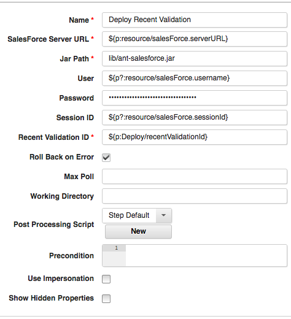

# Salesforce - Usage

## Usage

### [Salesforce Integration with IBM UrbanCode Deploy](https://community.ibm.com/community/user/wasdevops/blogs/laurel-dickson-bull1/2022/07/27/salesforce-integration-with-ibm-urbancode-deploy?CommunityKey=9adfe6b6-2e23-4895-8b27-38b93b5e152c#example-retrieve)

## [Example: Deploy Recent Validation ID](#example-deploy-recent-validation-id)

### Example: Deploy a Recent Validation ID

Version 5 of the plug-in introduces the ability to deploy a recent validation.Deploying a validation allows you to deploy faster by not rerunning tests associated with a deployment that was already validated.
A validation does not complete the deployment process to the organization. A validation is used to check the success or failure messages that you would receive with an actual deployment. To validate your deployments, add the checkOnly=true parameter in your deploy step.

Example Deploy step with Check Only set to true

This will cause the step to set the recentValidationId as an output property.From here, we can reference it in a Deploy Recent Validation step using ``${p:[Deploy Step Name]/recentValidationId}``.

Example Deploy Recent Validation step references a recentValidationId

|Back to ...||Latest Version|Salesforce ||||
| :---: | :---: | :---: | :---: | :---: | :---: | :---: |
|[All Plugins](../../index.md)|[Deploy Plugins](../README.md)|[10.1138575](https://raw.githubusercontent.com/UrbanCode/IBM-UCD-PLUGINS/main/files/SalesForce/ucd-salesforce-10.1138575.zip)|[Readme](README.md)|[Overview](overview.md)|[Steps](steps.md)|[Downloads](downloads.md)|
